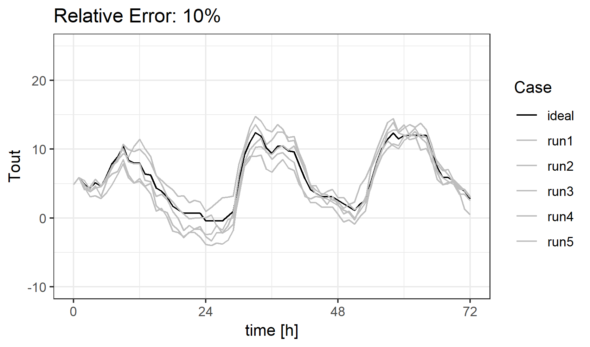

# Forecast generator

The package contains useful functions for creating quasi-random forecasts from ideal time series. It enables to create realistic "historical" forecasts from measurements:

See the attached presentation for an example of using such forecasts for testing robustness of Model Predictive Control: [PRESENTATION](https://github.com/krzysztofarendt/forecast-gen/blob/master/presentation/mpc_robustness.pdf)
